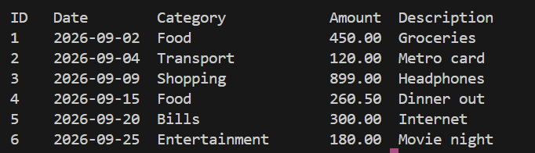
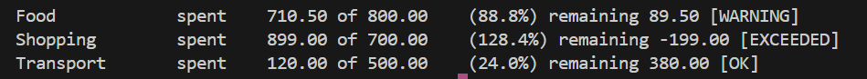
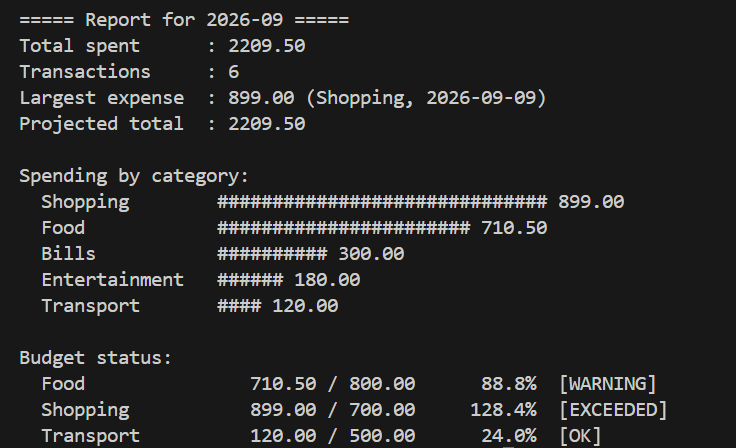
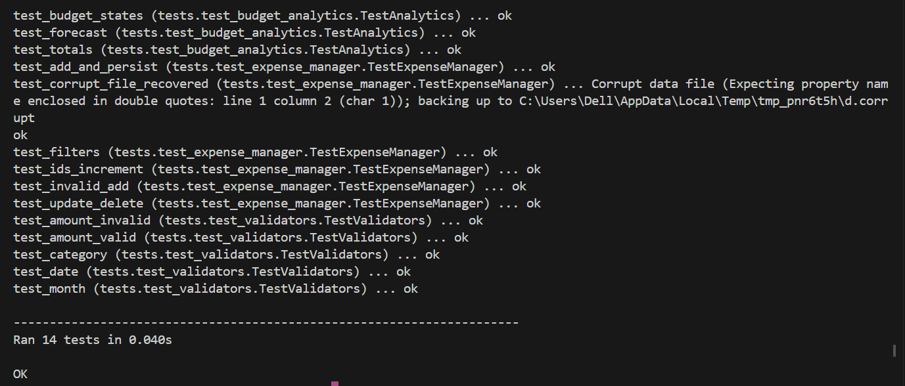

# Expense Tracker & Budget Analyzer

A command-line personal finance tool written in **pure Python** (standard library only) for the *Python Essentials* course, VITyarthi Build Your Own Project.

## Overview
Log daily expenses, set monthly category budgets, and get instant analytics and warnings from the terminal. Data is stored locally in a JSON file.

## Features
- **Expense management**: add, list, edit, delete; filter by month/category
- **Budget management**: per-category limits, status `OK` / `WARNING` (>=80%) / `EXCEEDED`, automatic warning when adding an expense
- **Analytics & reports**: totals, category breakdown, largest expense, month-end projection, ASCII bar chart
- **CSV export**
- **Robustness**: validation, atomic saves, corrupt-file backup, logging to `logs/app.log`
- Both **subcommand mode** and **interactive menu**

## Technologies
Python 3.8+ | `argparse`, `json`, `csv`, `dataclasses`, `logging`, `unittest` | Git

## Project Structure
```
expense-tracker/
├── main.py                  # entry point
├── src/
│   ├── models.py            # Expense dataclass
│   ├── validators.py        # input validation
│   ├── storage.py           # JSON persistence (DataStore)
│   ├── expense_manager.py   # CRUD
│   ├── budget.py            # budgets & status
│   ├── analytics.py         # calculations
│   ├── report.py            # text report + CSV export
│   ├── cli.py               # argparse + menu
│   └── logger_config.py     # logging
├── tests/                   # unit tests
├── data/sample_expenses.json
├── docs/ARCHITECTURE.md     # diagrams
├── statement.md
└── requirements.txt
```

## Installation & Run
1. Install Python 3.8 or newer: `python --version`
2. Clone the repo:
   ```bash
   git clone https://github.com/<your-username>/<repo-name>.git
   cd <repo-name>
   ```
3. (Optional) create a virtual environment:
   ```bash
   python -m venv .venv
   source .venv/bin/activate      # Windows: .venv\Scripts\activate
   ```
4. Install dependencies (none required): `pip install -r requirements.txt`
5. Run:
   ```bash
   python main.py            # interactive menu
   python main.py --help     # all commands
   ```

## Usage Examples
```bash
python main.py add --amount 250 --category food --desc "Lunch" --date 2026-09-10
python main.py list --month 2026-09
python main.py edit 1 --amount 300
python main.py delete 1
python main.py budget set food 5000
python main.py budget status --month 2026-09
python main.py summary --month 2026-09
python main.py export report.csv --month 2026-09
```
Try the bundled sample data without touching your own:
```bash
python main.py --data data/sample_expenses.json summary --month 2026-09
```

## Testing
```bash
python -m unittest discover -s tests -t . -v
```
Tests cover validators, CRUD, persistence, corrupt-file recovery, analytics, forecasting and budget states.

## Screenshots

### Listing expenses


### Budget status


### Monthly summary


### Input validation


### Tests passing


## Author
<ANANYA VAJPAYEE> - <Reg No. - 24BCE10584>
