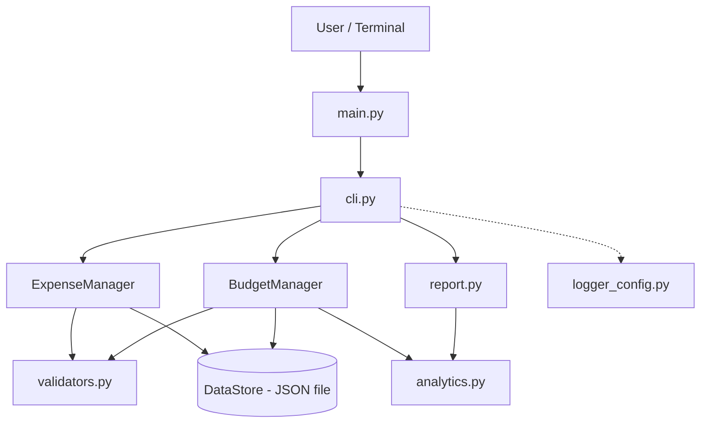
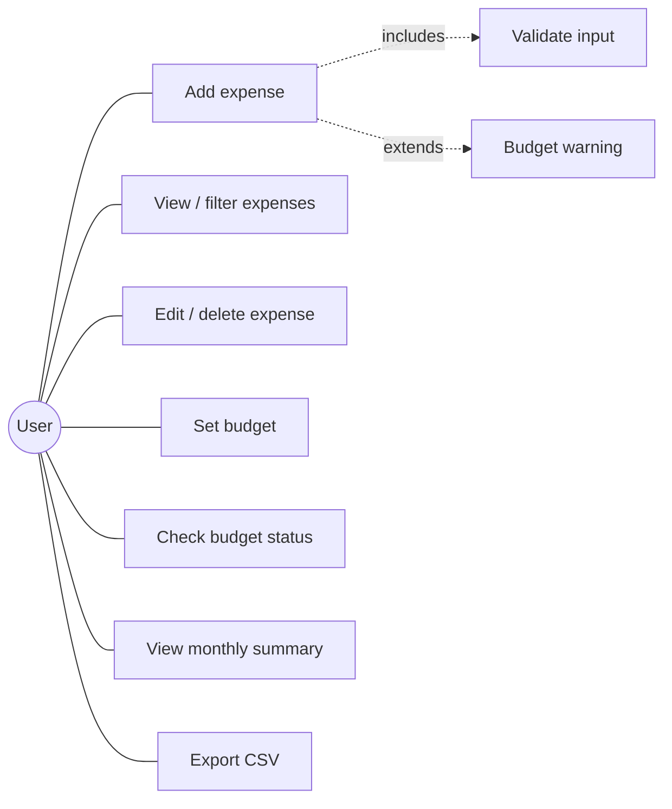
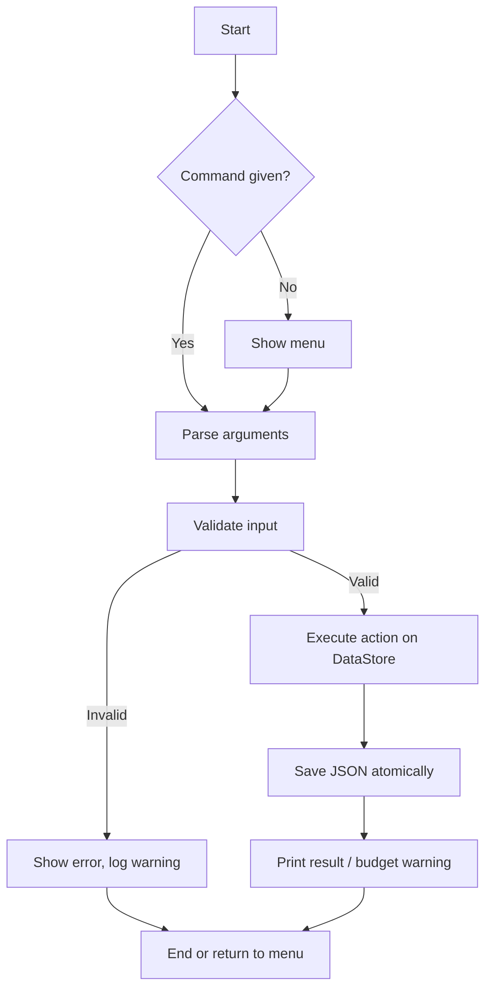
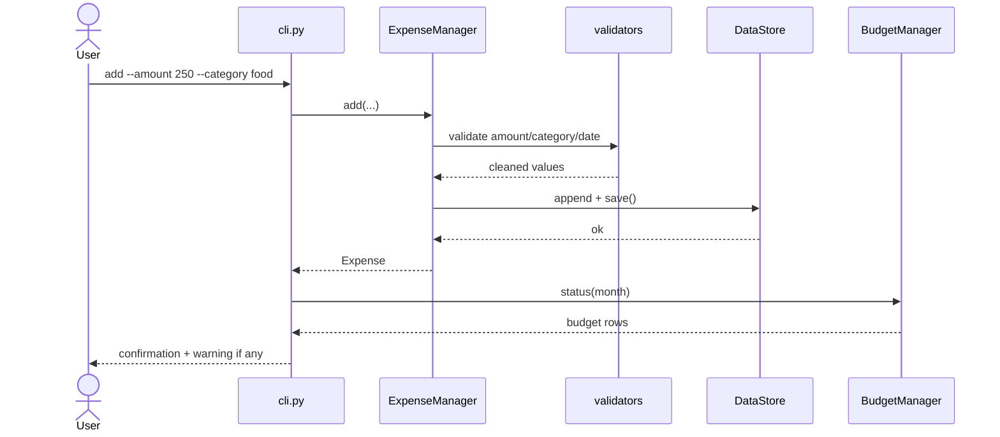
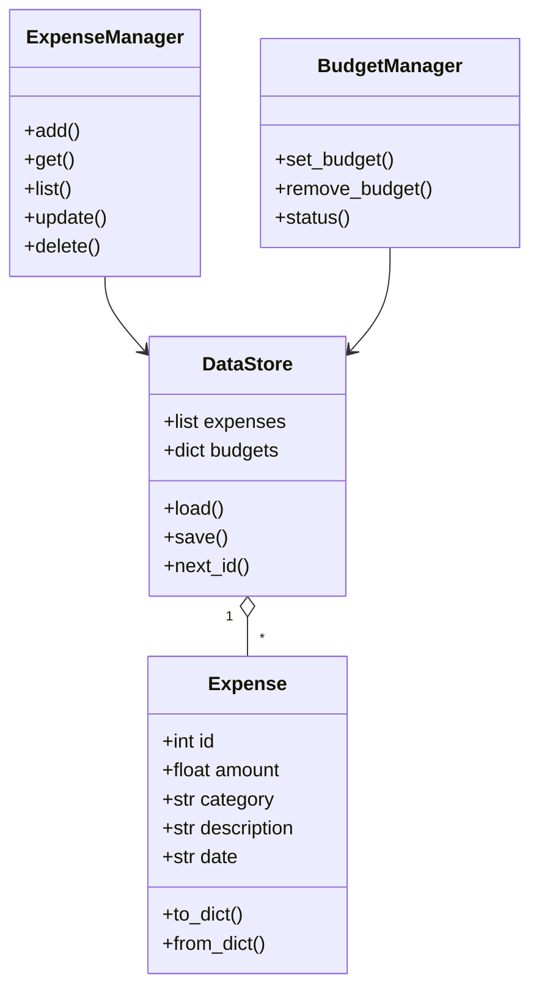
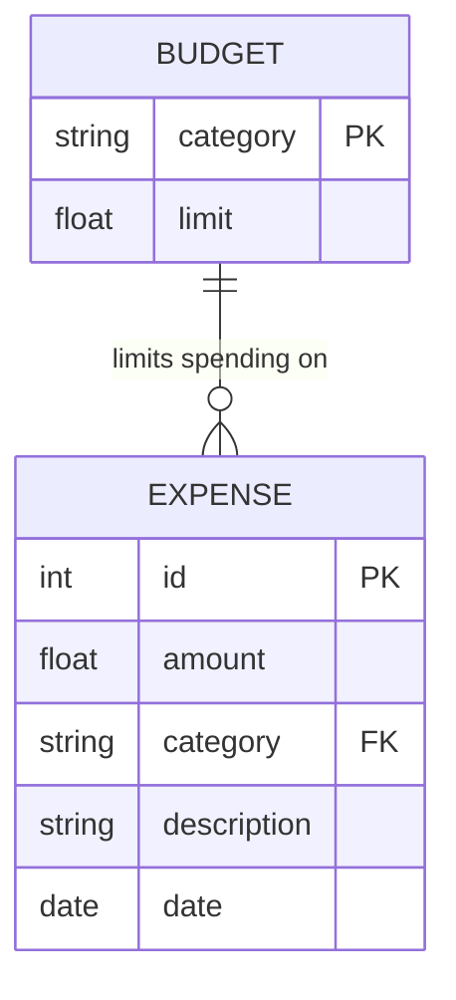

# Design Documentation

Diagrams are written in Mermaid (renders on GitHub). Export them as images for the PDF report via https://mermaid.live.

## Functional Requirements
| ID | Requirement |
|----|-------------|
| FR1 | Add an expense (amount, category, description, date) |
| FR2 | List/filter expenses by month and category |
| FR3 | Edit and delete expenses |
| FR4 | Set, view and remove category budgets |
| FR5 | Warn when a budget reaches 80% or is exceeded |
| FR6 | Generate monthly summary with category chart and projection |
| FR7 | Export expenses to CSV |

## Non-Functional Requirements
| Type | Requirement |
|------|-------------|
| Usability | Clear CLI messages; interactive menu and subcommands |
| Reliability | Atomic writes; corrupt data file backed up, app keeps running |
| Security/Validation | All input validated (positive amounts, valid dates/months, bounded category length) |
| Maintainability | Modular design, one responsibility per file, unit tests |
| Performance | Operations on thousands of records complete in milliseconds |
| Logging | Events and errors written to `logs/app.log` |

## System Architecture

## Use Case Diagram

## Workflow Diagram

## Sequence Diagram (Add Expense)

## Class Diagram

## Storage Design (ER)

Stored as one JSON document: `{"expenses": [...], "budgets": {...}}`.

## Design Decisions & Rationale
- **JSON over a database**: zero setup, human-readable, enough for personal data.
- **Single shared `DataStore`**: managers can't overwrite each other's changes.
- **Pure functions in `analytics.py`**: easy to test, no side effects.
- **Atomic save (temp file + replace)**: prevents data loss on crash.
- **argparse + menu**: scriptable for the evaluator, friendly for humans.
